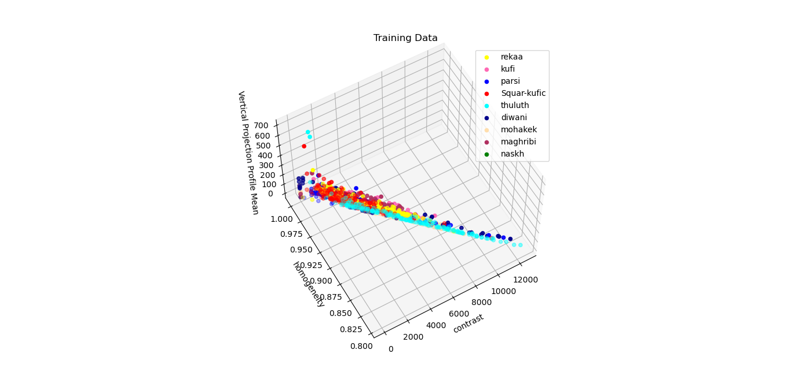

# Arabic Calligraphy Font Identification
## Requirements
[Requirements URL](https://drive.google.com/file/d/1_2A6YgcfejydRCz0BQXVHyOz66qUAhrH/view)
## Research Papers
**Note that** you don't need to open all research papers. From the following papers, they gave us a hint of which features to extract from an image to have the ability to identify fonts.
1. [Local Binary Patterns for Arabic Optical Font Recognition](https://www.researchgate.net/publication/286595227_Local_Binary_Patterns_for_Arabic_Optical_Font_Recognition)
2. [Font Recognition Based on Global Texture Analysis](http://www.cbsr.ia.ac.cn/publications/yzhu/Font%20Recognition%20Based%20on%20Global%20Texture%20Analysis.pdf)
3. [Large-Scale Visual Font Recognition](https://openaccess.thecvf.com/content_cvpr_2014/papers/Chen_Large-Scale_Visual_Font_2014_CVPR_paper.pdf)
4. [A Statistical Global Feature Extraction Method for Optical Font Recognition](https://link.springer.com/content/pdf/10.1007%2F978-3-642-20039-7_26.pdf)

## Data Illustrations
If we used **constrast** and **homogeneity** as our feature vector.
1. Diwani VS Naskh
    
2. Diwani VS Naskh VS Parsi
    
3. All 9 Fonts
    

If we added **vertical projection profile mean (VPP Mean)** feature to our feature vector


If we added preprocessing to the image and converting it to binary image with a threshold.
```Threshold = 170```
